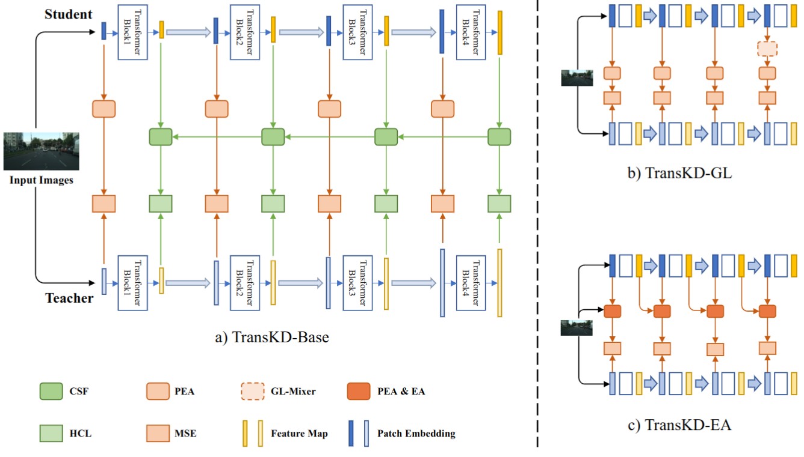

# Transformer Knowledge Distillation for Efficient Semantic Segmentation [[arxiv](https://arxiv.org/abs/2202.13393)]
## Structure: TransKD

## Introduction
We propose the structural framework, TransKD, to distill the knowledge from feature maps and patch embeddings of vision transformers. TransKD enables the non-pretrained vision transformers perform on-par with the pretrained ones.
## Requirements
Environment: create a conda environment and activate it
```
conda create -n TransKD python=3.6
conda activate TransKD
```
Additional python pachages: [poly scheduler](https://github.com/cmpark0126/pytorch-polynomial-lr-decay) and
```
pytorch == 1.7.1+cu92
torchvision == 0.8.2+cu92
mmsegmentation == 0.15.0
mmcv-full == 1.3.10
numpy
visdom
```
Datasets:
* Cityscapes: download `gtFine_trainvaltest.zip` and `leftImg8bit_trainvaltest.zip` from [cityscapes official website](https://www.cityscapes-dataset.com/downloads/), then prepare the 19-class label with the `createTrainIdLabelImgs.py` from [cityscapesscripts](https://github.com/mcordts/cityscapesScripts/tree/master/cityscapesscripts/preparation).
* ACDC： download `gt_trainval.zip` and `rgb_anon_trainvaltest.zip` from [ACDC official website](https://acdc.vision.ee.ethz.ch/download).


## Model Zoo

Cityscapes:
|Network      |#Params(M)|GFLOPs|mIoU(%)|weight|
|:------------|:---------|:-----|:------|:-----|
|Teacher(B2)  |27.36     |113.84|76.49  |[Google Drive](https://drive.google.com/file/d/1mixZrRm-nSOhIjM4ltI_wegc14iciZZS/view?usp=drive_link)|
|Student(B0)  |3.72      |13.67 |55.86  |[Google Drive](https://drive.google.com/file/d/1BCA2LHtWSSUzF0xbWELwLw66SdduYJ3X/view?usp=drive_link)|
|+TransKD-Base|4.56      |16.47 |68.58  |[Google Drive](https://drive.google.com/file/d/1KkQ2IfEfQnisWle4yob3JDEBYvGsGvhn/view?usp=drive_link)|
|+TransKD-GL  |5.22      |16.80 |68.87  |[Google Drive](https://drive.google.com/file/d/1MSQkF8wbC-QPy9vFQOazjkEOKPbUK1i0/view?usp=drive_link)|
|+TransKD-EA  |5.53      |17.84 |68.98  |[Google Drive](https://drive.google.com/file/d/1NejCOa2S5t8_8ooJT1Yauzrz-POCwr5H/view?usp=drive_link)|


[PVTv2 teacher](https://drive.google.com/file/d/1D5IDzWe1uEzuGqXnDHsF_n5U0cvh1I8t/view?usp=drive_link)

ACDC: 
|Network      |mIoU(%)|weight|
|:------------|:------|:-----|
|Teacher(B2)  |69.34  |[Google Drive](https://drive.google.com/file/d/1o-z_Jaty4ENJ2ruvVMGUng1yOKamMxU1/view?usp=drive_link)|
|Student(B0)  |46.26  |[Google Drive](https://drive.google.com/file/d/1JL-yXf4izAwHScLN3Vt330HQjs1V4B-a/view?usp=drive_link)|
|+TransKD-Base|58.56  |[Google Drive](https://drive.google.com/file/d/1B_7p-31WKtXuWm1CPW0l9mBISUkMjZnk/view?usp=drive_link)|
|+TransKD-GL  |58.13  |[Google Drive](https://drive.google.com/file/d/1ZRi7mUXXDYFpO4MRC5ekPCqoSQwFYgYt/view?usp=drive_link)|
|+TransKD-EA  |59.09  |[Google Drive](https://drive.google.com/file/d/1FpTdOkmjy2p48R6cezi43J2HbOVVuUA1/view?usp=drive_link)|

## Training
Download pretrained weights ([SegFormer](https://drive.google.com/drive/folders/1b7bwrInTW4VLEm27YawHOAMSMikga2Ia?usp=sharing) and [PVTv2](https://github.com/whai362/PVT/tree/v2/classification)) to the folder `\train\ckpt_pretained\`.
```
cd train
CUDA_VISIBLE_DEVICES=0 python TransKDBase.py --dataset cityscapes --dataset /path/to/cityscapes #--dataset ACDC --dataset /path/to/ACDC
CUDA_VISIBLE_DEVICES=0 python TransKD_GLMixer.py --dataset cityscapes --dataset /path/to/cityscapes #--dataset ACDC --dataset /path/to/ACDC
CUDA_VISIBLE_DEVICES=0 python TransKD_EA.py --dataset cityscapes --dataset /path/to/cityscapes #--dataset ACDC --dataset /path/to/ACDC
```
## Evaluation
Download trained weights ([Google Drive](https://drive.google.com/drive/folders/1vHRH3nUCdKVSrOe_VX_L9GrcJNytmUAj?usp=drive_link)) to the folder `\outputs`.
```
cd eval
CUDA_VISIBLE_DEVICES=0 python eval_cityscapes_iou.py --distillation-type TransKDBase
CUDA_VISIBLE_DEVICES=0 python eval_cityscapes_color.py --distillation-type TransKDBase
CUDA_VISIBLE_DEVICES=0 python eval_ACDC_iou.py --distillation-type TransKDBase
CUDA_VISIBLE_DEVICES=0 python eval_ACDC_color.py --distillation-type TransKDBase
# distillation-type can be choices=['teacher','student','TransKDBase','TransKD_GL','TransKD_EA']
```


## Publication
If you find this repo useful, please consider referencing the following paper [[PDF](https://arxiv.org/pdf/2202.13393)]:
```
@article{liu2022transkd,
  title={TransKD: Transformer Knowledge Distillation for Efficient Semantic Segmentation},
  author={Liu, Ruiping and Yang, Kailun and Roitberg, Alina and Zhang, Jiaming and Peng, Kunyu and Liu, Huayao and Stiefelhagen, Rainer},
  journal={arXiv preprint arXiv:2202.13393},
  year={2022}
}
```
